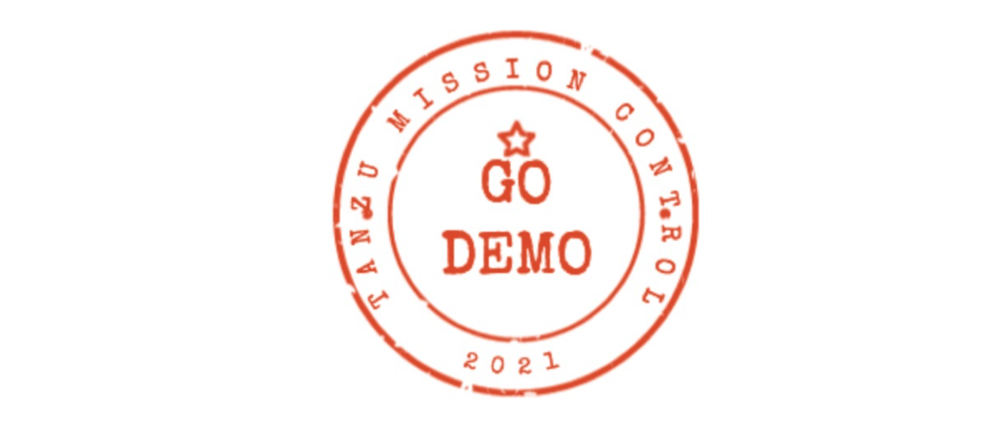

# tmc-gitops-demo

This is a demo repo that showcases how the GitOps model might be used to create/manage TMC objects like LCM clusters, policies etc.

Tested with 
* tmc version: 0.2.1-7e9c62fc
* clustergroup
* cluster
* workspace
* namespaces
* policies: IAM, Registry, Network

Based on https://www.youtube.com/watch?v=_ROS1xIBxmA by @KeithRichardLee

# Before
1. Create the Cluster Group defined in [tmc-objects/clustergroups/dev.yaml](tmc-objects/clustergroups/dev.yaml)
2. Create the dev cluster defined in [tmc-objects/clusters/dev-cluster-01.yaml](tmc-objects/clusters/dev-cluster-01.yaml)

# Demo

1. Update the Cluster Group defined in [tmc-objects/clustergroups/dev.yaml](tmc-objects/clustergroups/dev.yaml)
2. Create a new Cluster: duplicated the file [tmc-objects/clusters/dev-cluster-01.yaml](tmc-objects/clusters/dev-cluster-01.yaml) and change its name (#3)
3. Create a new Workspace [tmc-objects/workspaces/micropet-dev-ws.yaml](tmc-objects/workspaces/micropet-dev-ws.yaml)
4. Create a namespace into this Workspace [tmc-objects/namespace/micropet-ns-dev.yaml](tmc-objects/namespace/micropet-ns-dev.yaml)
4. Apply policies on clusters : access, images, network directory
5. Upgrade the demo cluster from `1.19.4-1-amazon2` -> `1.19.6-2-amazon2`    
6. Walkthrough UI.

# After the demo
````
./clean.sh
`````


